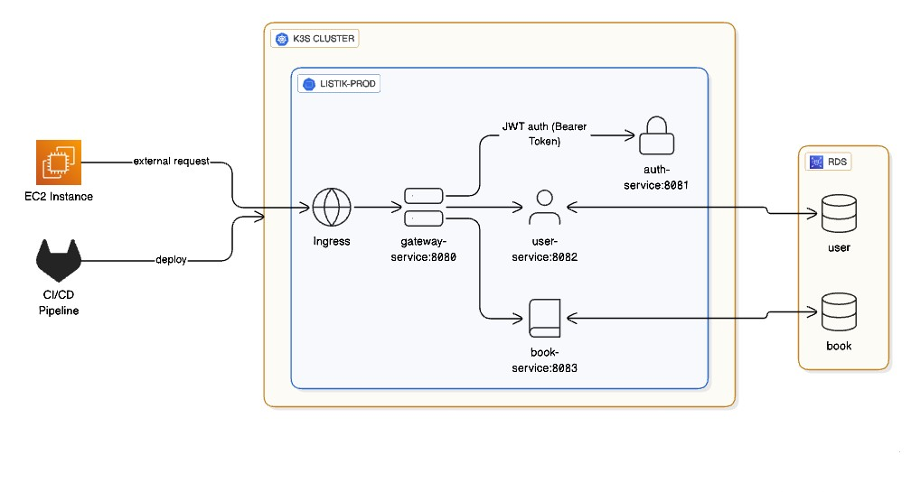
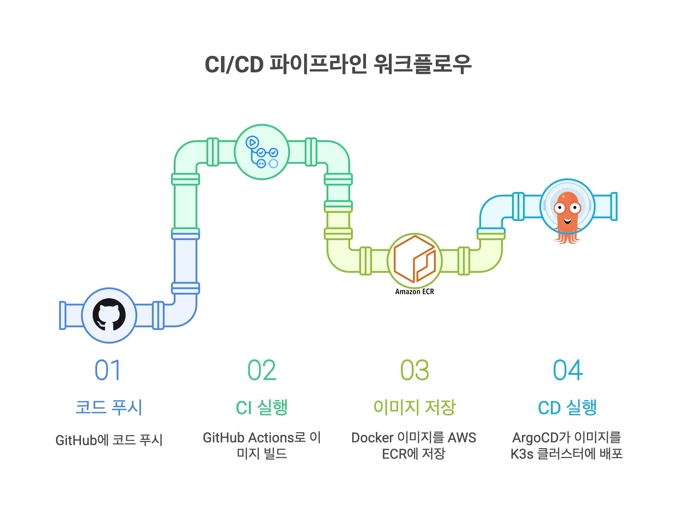

# Listik Backend

Spring Boot와 Kotlin으로 구축된 북 트래커 애플리케이션의 마이크로서비스 기반 백엔드입니다.

## I. 아키텍처 개요



마이크로서비스 아키텍처 기반으로 설계된 Listik Backend는 다음과 같은 구조를 가집니다:

- **클라이언트**: 모바일/웹 애플리케이션
- **API 게이트웨이**: Spring Cloud Gateway (8080포트)
- **마이크로서비스**: Auth, User, Book, Core 서비스
- **데이터베이스**: PostgreSQL (서비스별 스키마 분리)
- **서비스 간 통신**: FeignClient를 통한 HTTP 통신

## II. 기술 스택

- **백엔드**: Spring Boot 3.2.5, Kotlin 1.9.25
- **아키텍처**: 마이크로서비스 + 헥사고날 아키텍처 (Book Service)
- **데이터베이스**: PostgreSQL (서비스별 스키마 분리)
- **API 게이트웨이**: Spring Cloud Gateway
- **인증**: OAuth2 (Google/Apple) + JWT
- **컨테이너화**: Docker + Docker Compose
- **오케스트레이션**: Kubernetes with Kustomize
- **CI/CD**: GitHub Actions + AWS ECR
- **모니터링**: Spring Boot Actuator

## III. 서비스 구성

### 1. Gateway Service (Port 8080)
- API 라우팅 및 로드 밸런싱
- 요청/응답 필터링
- Circuit Breaker 패턴

### 2. Auth Service (Port 8081)
- OAuth2 통합 (Google, Apple)
- JWT 토큰 생성 및 검증
- 사용자 인증 플로우

### 3. User Service (Port 8082)
- 사용자 프로필 관리
- 내부 사용자 운영
- 계정 생명주기 관리

### 4. Book Service (Port 8083)
- 도서 추적 기능
- 읽기 상태 관리 (읽을 예정, 읽는 중, 완독)
- 헥사고날 아키텍처 구현
- 검색 및 페이지네이션

### 5. Core Service
- 공유 DTO 및 유틸리티
- 공통 오류 처리
- Swagger 설정

## IV. 개발 환경 설정

### 1. 필수 요구사항
- JDK 17+
- Docker & Docker Compose
- PostgreSQL (Docker로 실행)

### 2. 빠른 시작

```bash
# 저장소 클론
git clone <repository-url>
cd listik-backend-v1

# PostgreSQL 시작
docker-compose up postgres -d

# 모든 서비스 빌드
./gradlew build

# 특정 서비스 실행
./gradlew :auth-service:bootRun
```

### 3. Docker로 실행

```bash
# 모든 서비스 시작
docker-compose up --build

# 로그 확인
docker-compose logs -f auth-service

# 서비스 중지
docker-compose down
```

## V. 배포

### 1. Kubernetes 배포

```bash
# 기본 설정 적용
kubectl apply -k deploy/base/

# 프로덕션 오버레이 적용
kubectl apply -k deploy/overlays/prod/

# 상태 확인
kubectl get pods -n listik-prod
```

### 2. CI/CD 파이프라인



완전 자동화된 GitOps 기반 CI/CD 파이프라인:

#### CI 단계 (GitHub Actions)
1. **코드 푸시**: 개발자가 GitHub에 코드 푸시
2. **변경 감지**: 서비스별 경로 모니터링 (auth-service, user-service, book-service, gateway-service)
3. **병렬 빌드**: Matrix 전략으로 변경된 서비스만 빌드
4. **이미지 푸시**: Docker 이미지 빌드 후 AWS ECR에 푸시
5. **매니페스트 업데이트**: 새 이미지 태그로 Kustomization 파일 업데이트
6. **GitOps 커밋**: 업데이트된 매니페스트를 저장소에 자동 커밋

#### CD 단계 (ArgoCD)
1. **변경 감지**: ArgoCD가 Git 저장소의 매니페스트 변경사항 감지
2. **자동 배포**: EC2 K3s 클러스터의 `listik-prod` 네임스페이스에 자동 배포
3. **시크릿 해독**: Sealed Secret Controller가 암호화된 시크릿을 해독하여 Secret 생성
4. **롤링 업데이트**: 무중단 배포로 새 버전 서비스 교체
5. **헬스 체크**: 배포 완료 후 서비스 상태 확인

#### 주요 특징
- **제로다운타임**: 롤링 업데이트를 통한 무중단 배포
- **보안**: OIDC 인증, Sealed Secret을 통한 암호화된 시크릿 관리
- **효율성**: 변경된 서비스만 선택적 빌드 및 배포
- **추적 가능**: 모든 배포 이력이 Git 히스토리로 관리

## VI. API 문서

각 서비스는 `/swagger-ui.html`에서 Swagger UI를 제공:
- Gateway: http://localhost:8080/swagger-ui.html
- Auth: http://localhost:8081/swagger-ui.html
- User: http://localhost:8082/swagger-ui.html
- Book: http://localhost:8083/swagger-ui.html

## VII. 데이터베이스 설계

```sql
-- 서비스별 스키마 분리
CREATE SCHEMA user;
CREATE SCHEMA book;

-- 서비스별 역할 및 권한
CREATE ROLE user;
CREATE ROLE book;
```

## VIII. 설정

### 1. 환경 변수

| 변수명 | 설명 | 기본값 |
|--------|------|--------|
| `JWT_SECRET` | JWT 서명 시크릿 | - |
| `JWT_EXPIRATION` | 토큰 만료시간 (ms) | 86400000 |
| `GOOGLE_CLIENT_ID` | Google OAuth2 클라이언트 ID | - |
| `APPLE_CLIENT_ID` | Apple OAuth2 클라이언트 ID | - |
| `POSTGRES_USER` | 데이터베이스 사용자명 | app_admin |
| `POSTGRES_PASSWORD` | 데이터베이스 비밀번호 | admin_pass |
| `POSTGRES_DB` | 데이터베이스명 | appdb |

### 2. 서비스 간 통신

서비스는 FeignClient를 사용하여 HTTP 통신:

```kotlin
@FeignClient(name = "user-service", url = "\${user-service.url}")
interface UserServiceClient {
    @PostMapping("/internal/users")
    fun createUser(@RequestBody request: CreateUserRequest): UserResponse
}
```

## IX. 모니터링 & 헬스 체크

모든 서비스는 Spring Boot Actuator 포함 (추후 Prometheus, Grafana 등 구현 예정)

## X. 보안

- Google/Apple OAuth2 인증
- 만료시간 설정 가능한 JWT 토큰
- 서비스 간 인증
- 데이터베이스 스키마 격리
- Kubernetes 시크릿 관리

## XI. 라이선스

이 프로젝트는 MIT 라이선스 하에 배포됩니다. 자세한 내용은 [LICENSE](./LICENSE) 파일을 참조하세요.